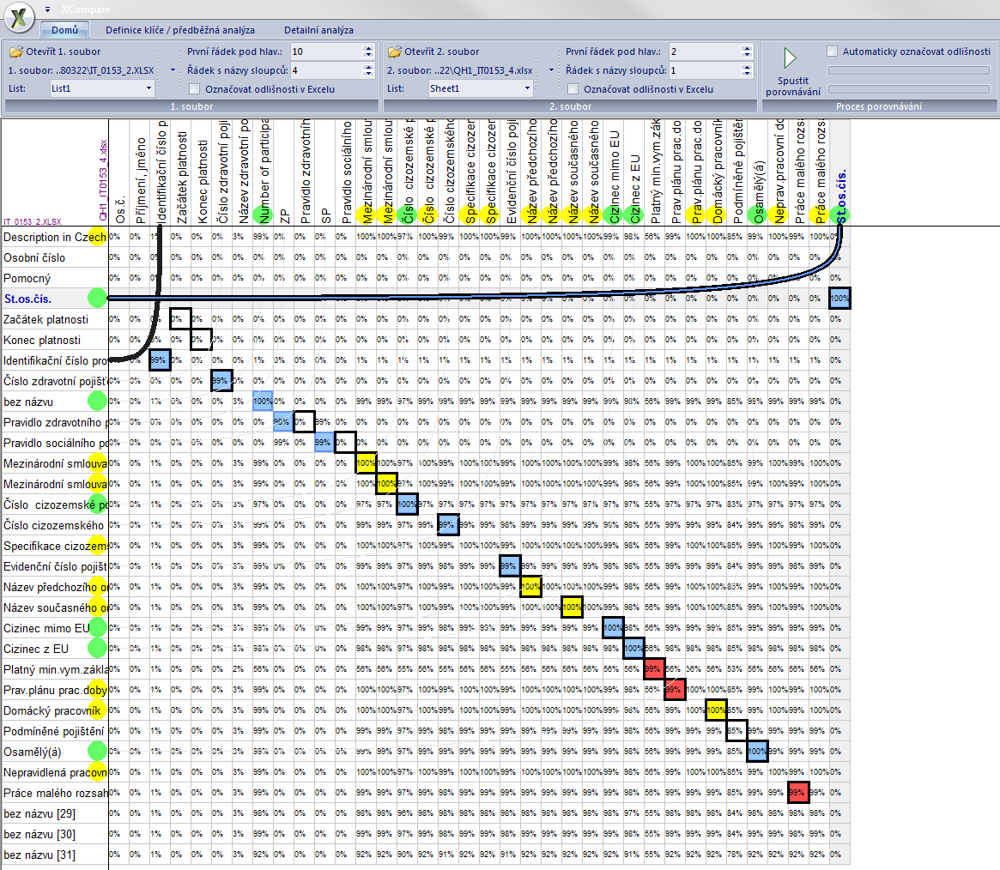
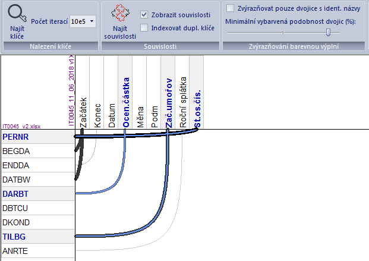

XCompare is a fast comparison tool for Excel tables. It can also extract relationships of both tables.

Its main benefits and the purposes for which this tool was made are:
- It can compare two structurally different (database like) Excel tables - with different headers, different order of columns and/or rows.
- It provides a fully automatic comparison process if columns' names across tables' are identical. In this case, the tool can mark all discovered differences directly in the Excel files (via OLE) - and, as well as in the 'normal' mode, even in cases when columns and/or rows are randomly shuffled.
- since version 2, this app is also able to find and visualize relationships between columns across the tables. The relationship is visually represented by a conecting line between columns across the tables. The extent of the relationship is expressed by each line's width (i.e. value similarity of columns) and its darkness (i.e. their 'entropy' similarity)

Note: XCompare makes use of the Microsoft Excel application (through OLE interprocess communication) so make sure you have it installed before using XCompare. This way, XCompare can mark all the found differences directly and visibly/transparently in the open XLS(X) documents. 
Be aware: The program can consume a LOT of memory - especially when searching for the usable keys.

Also note: The tool's UI is currently available only in czech lang.

-------------------------------------------------------------------------------------------------------------------
License notice: The application and all its parts including its source code may be freely used in any way, with the reservation that if you use parts of the source code in your own work you should mention the author's name in the derivative source code.

Distribution status: All files in this repository are available to public domain.
